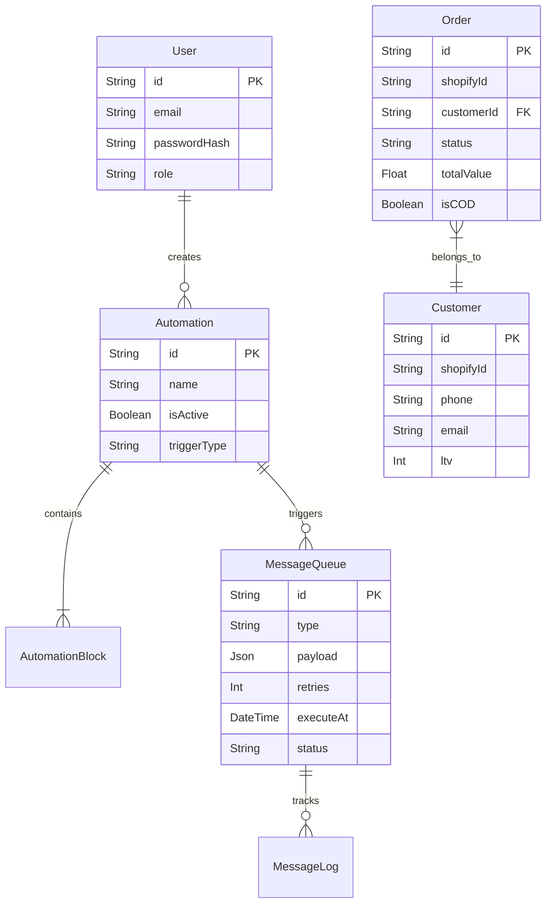

# Database Documentation

VAQUITA uses PostgreSQL 16 with Prisma ORM.

## Entity Relationship Diagram

## Migration Strategy

Migrations are handled entirely via Prisma (`npx prisma migrate dev` locally, `npx prisma migrate deploy` in CI/CD).
We use a forward-only migration strategy. Rollbacks are achieved by creating a new migration that reverts the changes of the previous one.

## Backup Strategy

In Railway, automated daily backups are configured for the PostgreSQL volume.
For manual snapshots, utilize Railway's database snapshot feature before applying major schema migrations.
